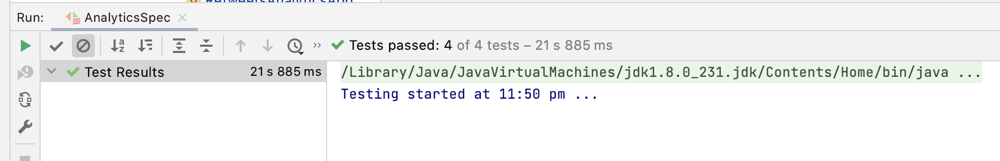

# Twitter subscribers
Pet Project with Spark and Python/Scala

## Spark Introduction task
1. Create a generator Parquet files with twitter data for this Task. 
   Each Parquet file contains one of the tables below. 
2. You need to read Parquet files and solve the following task: "A user posts a provocative message on Twitter. 
   His subscribers do a retweet. Later, every subscriber's subscriber does retweet too."
3. Find the top ten users by a number of retweets in the first and second waves.

Entity's description.

**Name**: USER_DIR.

Description: Table contains first and last names.

| USER_ID  | FIRST_NAME | LAST_NAME |
| -------- | ---------- | --------- |
| 1        | "Robert"   | "Smith"   |
| 2        | "John"     | "Johnson"  |
| 3        | "Alex"     | "Jones"   |
| ...      | ...        | ...       |

**Name**: MESSAGE_DIR

Description: Table contains text message.

| MESSAGE_ID | TEXT     |
| --------   | -------- |
| 11         | "text"   |
| 12         | "text"   |
| 13         | "text"   |
| ...        | ...      |

**Name**: MESSAGE

Description: Table contains information about posted messages.

| USER_ID    | MESSAGE_ID |
| --------   | --------   |
| 1          | 11         |
| 2          | 12         |
| 3          | 13         |
| ...        | ...        |

**Name**: RETWEET

Description: Table contains information about retweets.

| USER_ID  | SUBSCRIBER_ID | MESSAGE_ID |
| -------- | ---------- | --------- |
| 1        | 2   | 11   |
| 1        | 3     | 11  |
| 2        | 5     | 11  |
| 3        | 7     | 11   |
| 7        | 14     | 11   |
| 5        | 33     | 11  |
| 2        | 4     | 12   |
| 3        | 8     | 13   |
| ...      | ...        | ...       |

"Top one user" looks the following

| USER_ID  | FIRST_NAME | LAST_NAME | MESSAGE_ID |  TEXT  | NUMBER_RETWEETS |
| -------- | ---------- | --------- | ---------- | ------ | --------------- |
| 1        | "Robert"   | "Smith"   | 11         | "text" | 4               |

### Task acceptance criteria
Task solution should contain:
1. Task solution with Dataframe or Dataset API.
2. Unit tests.
3. Example of Parquet files.
4. Generator for creating Parquet files.

### Installation
Project requires [sbt](https://www.scala-sbt.org/1.x/docs/Setup.html) and [pip](https://pypi.org/project/pip/) 
installations.
1. `git clone git@github.com:Samarkina/twitter-subscribers.git`
2. `sbt run`

### Run project
1. For running generator needs to run 
   `/scripts/main.py`
2. For running analytics needs to run 
   `/retweets-analytics/src//src/main/scala/com/chernogorova/bigdata/analytics/RetweetsAnalyticsApp.scala`

### Example
Analytic App provides table following in the picture for data in 
`/retweets-analytics/src/main/resources/2021-01-06/received=20-55-34/` folder:

